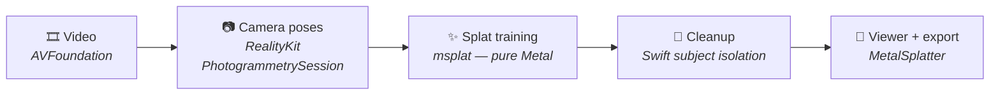

# Savor Native

**Drop in a video of an object. Get back a 3D scene you can orbit, relight
your imagination around, and export — all on your Mac, all Apple-native.**

Savor Native turns an ordinary handheld video (walk a slow circle around a
thing) into a [3D Gaussian splat](https://en.wikipedia.org/wiki/Gaussian_splatting)
— a photoreal, free-viewpoint reconstruction — using Apple's own frameworks
end to end. No Python, no COLMAP, no cloud, no GPU farm. One Swift package.

## How it works



1. **Frames** — AVFoundation decodes the video and keeps the sharpest frame
   in each time window (a luma-gradient score, so motion blur never reaches
   the trainer).
2. **Poses** — RealityKit's `PhotogrammetrySession` registers every frame's
   camera position and intrinsics and builds a sparse point cloud. This is
   the pipeline's quiet superpower: it replaces COLMAP with an OS framework,
   works from plain frames, and **requires no LiDAR**.
3. **Training** — [msplat](https://github.com/rayanht/msplat), a 3D Gaussian
   splatting trainer written entirely in Metal compute shaders, optimizes
   ~15k steps on-device. Checkpoints stream into the app as they land, so
   you watch the scene sharpen live — and can stop early and keep it.
4. **Cleanup** — a pure-Swift pass strips floaters and haze, then isolates
   the filmed subject: everything outside the camera orbit is provably
   environment, and a connected-component flood over the remaining mass
   separates the object from the room without amputating thin parts.
5. **View + export** — MetalSplatter renders the result in an interactive
   viewer. Export the splat (PLY/USDZ), a PNG of any viewpoint, or a
   360° orbit video — with or without the capture's own soundtrack.

## In the app

- **Live processing view** — no loading screens; you see the actual splat
  refining, with a console line showing the exact pipeline step
  ("msplat step 8,214 of 15,000").
- **Finish Now** — happy with the preview at 6k steps? Stop training there
  and get the cleaned splat immediately.
- **Cleaned / Custom / Unfiltered** — the isolated subject, the raw scene,
  or a live scrubber in between that melts the environment away as you drag.
- **Auto orientation** — scenes come up right-side-up, derived from the
  capture's own camera ring (with a manual Flip override).
- **Soundtrack** — loop the original video's audio under the 3D scene,
  volume-normalized across captures.

## What films best

Walk a **slow, full circle** around one object (20–60 s), keeping it
centered and filling about half the frame, in even light. Avoid shiny,
transparent, or moving subjects and fast pans. The app's built-in tips
popover (the **?** button) has an illustrated version.

## Running it

Requirements: an Apple silicon Mac on **macOS 26+** with **Xcode 26+**.

```sh
swift run -c release savor-native
```

Drop a video onto the window or click **New capture**. Capture workspaces
live under `~/Library/Application Support/SavorNative/captures/`. You can
also open a splat file directly:

```sh
swift run -c release savor-native /path/to/scene.ply
```

<details>
<summary><strong>Optional extras & developer tools</strong></summary>

### SHARP instant preview

```sh
./scripts/setup-sharp.sh
```

With Apple's [SHARP](https://github.com/apple/ml-sharp) model installed
(`~/.savor-native/sharp/bin/sharp` or `SAVOR_SHARP_BIN`), a single-image
splat prediction appears seconds after import, while real training runs.

### Pose dataset CLI

```sh
swift run poses-cli /path/to/images /path/to/output --sequential --high-sensitivity
```

Emits a Nerfstudio-compatible dataset (`transforms.json`, `sparse_pc.ply`,
linked `images/`) from any frame directory.

### Tests

```sh
swift test
```

### visionOS stub

```sh
swift run -c release savor-vision
```

RealityKit's native `GaussianSplatComponent` rendering needs the OS-27
cycle — see [`docs/phase3-findings.md`](docs/phase3-findings.md).

### msplat backend

msplat 1.1.3 is vendored under `Vendor/msplat/` (Metal xcframework + Swift
wrapper). The app trains in-process by default; set
`SAVOR_MSPLAT_BACKEND=cli` to use the bundled CLI instead.

</details>

## Why this exists

Three of the four layers needed for on-device splatting — capture, pose
estimation, rendering — already ship in macOS. This project connects them,
fills the training gap with the community's Metal work, and wraps it in an
app. The build story, including every bug the real captures surfaced, is in
[`docs/build-story.md`](docs/build-story.md).

Built on [msplat](https://github.com/rayanht/msplat) and
[MetalSplatter](https://github.com/scier/MetalSplatter). Sibling project of
the cross-platform [Savor](https://github.com/hridaew/savor).
